# Tatjana Marković Frontend Mentor - The Simple Bookmark Manager

## Table of contents

  - [Overview](#overview)
  - [The challenge](#the-challenge)
  - [Screenshot](#screenshot)
  - [Links](#links)
  - [My process](#my-process)
  - [Built with](#built-with)
  - [Author](#author)
  
## Overview
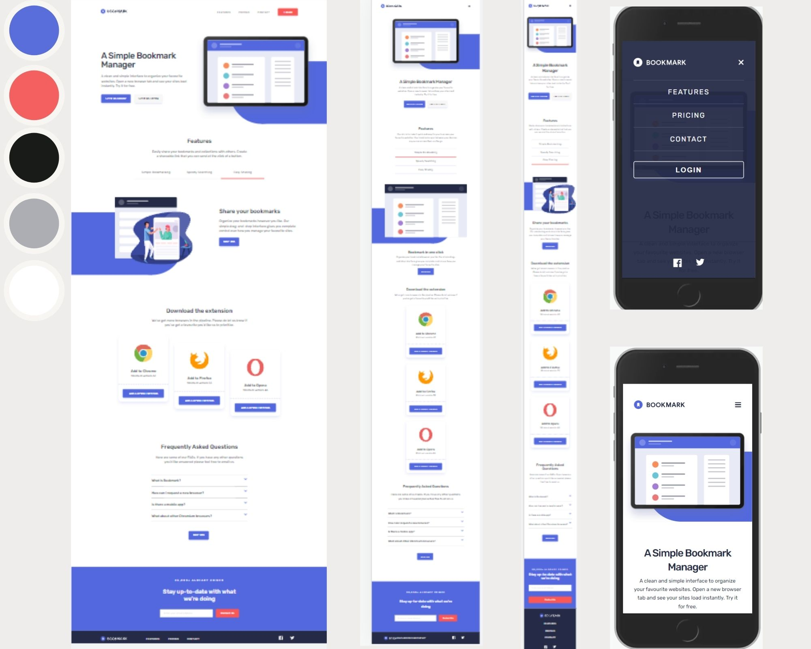
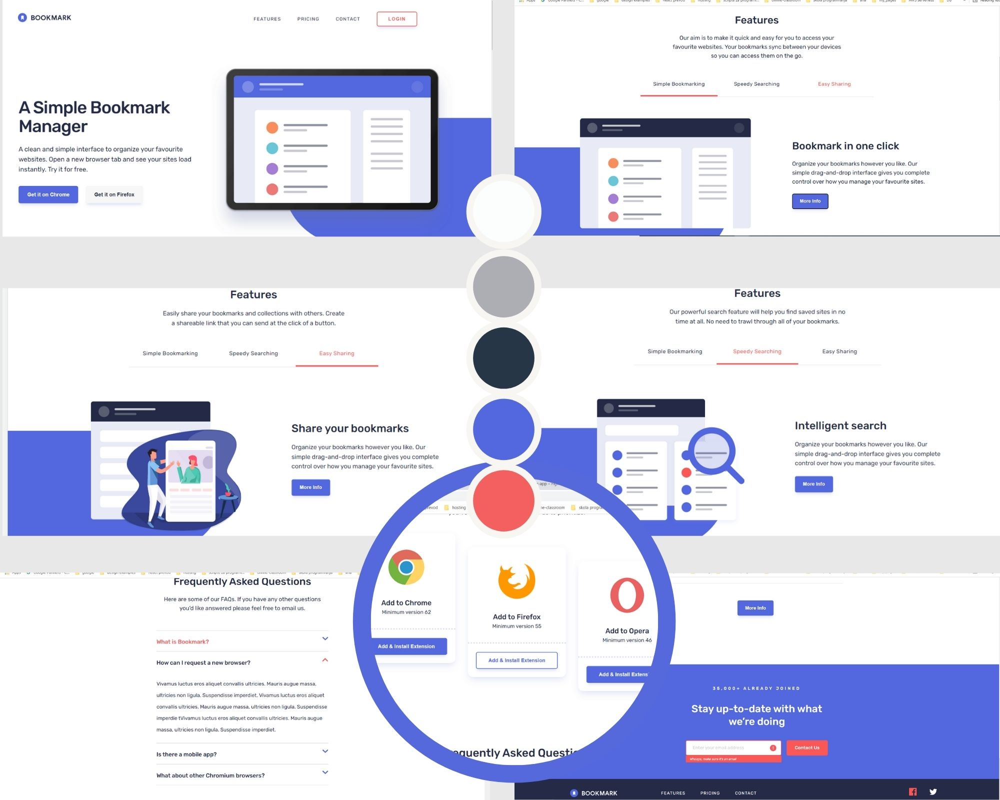

## The challenge

Your challenge is to build out this landing page and get it looking as close to the design as possible.

Your users should be able to:

- View the optimal layout for the site depending on their device's screen size
- See hover states for all interactive elements on the page
- Receive an error message when the newsletter form is submitted if:
  - The input field is empty
  - The email address is not formatted correctly

For this challenge you'll need to:

- Create the rounded blue background shape with code
- Change the `fill` and `stroke` color of the SVGs at specific points (the challenge can be completed using the single `logo-bookmark.svg` file provided)

### Screenshot

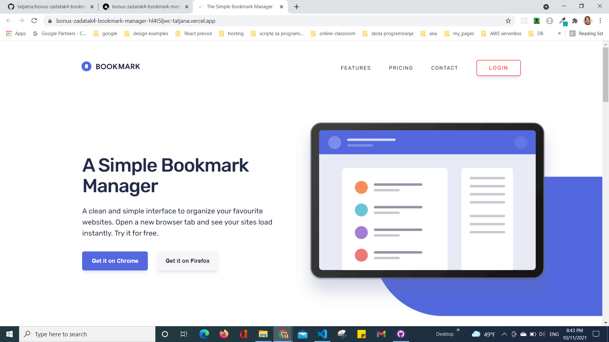
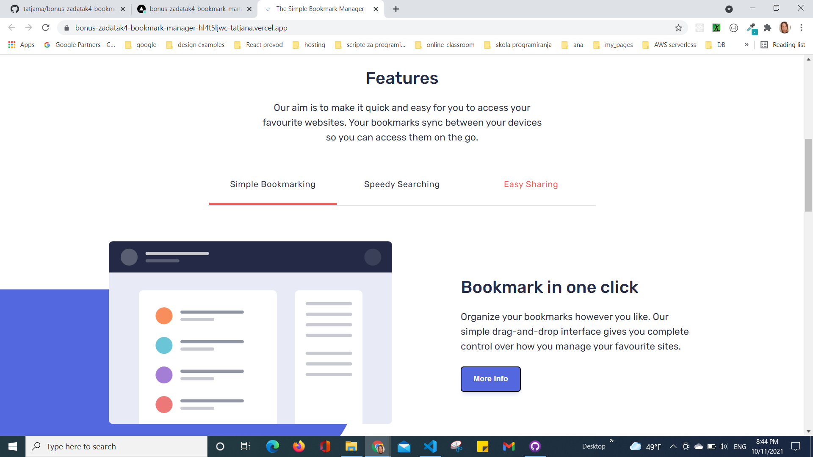
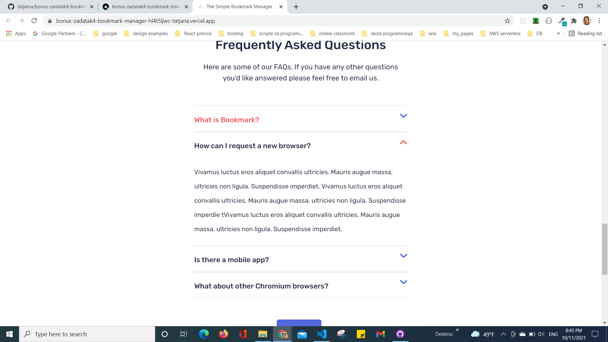
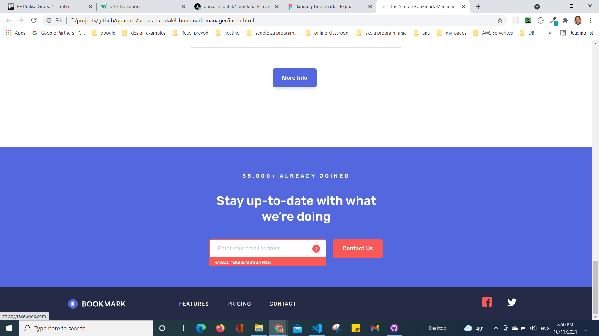
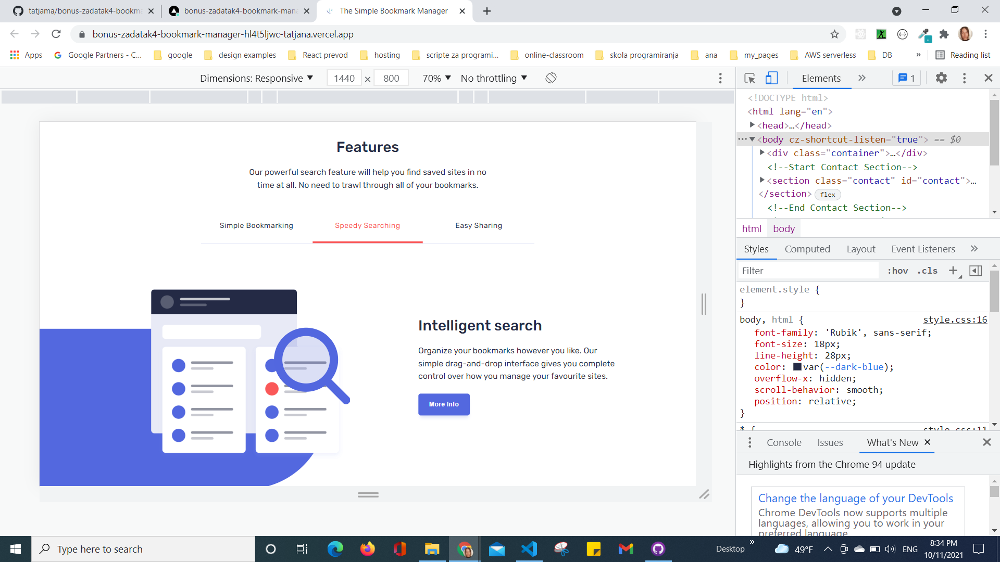
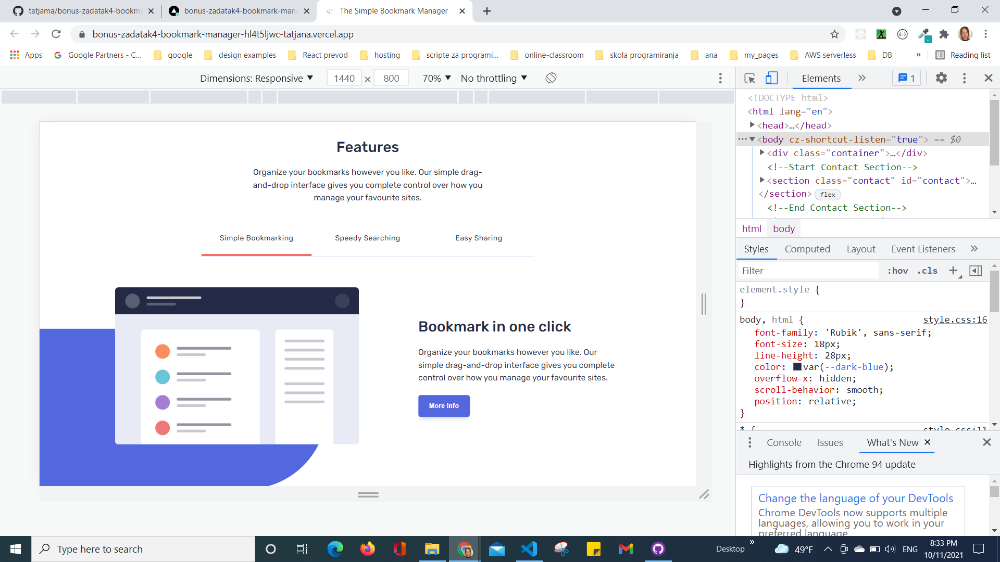
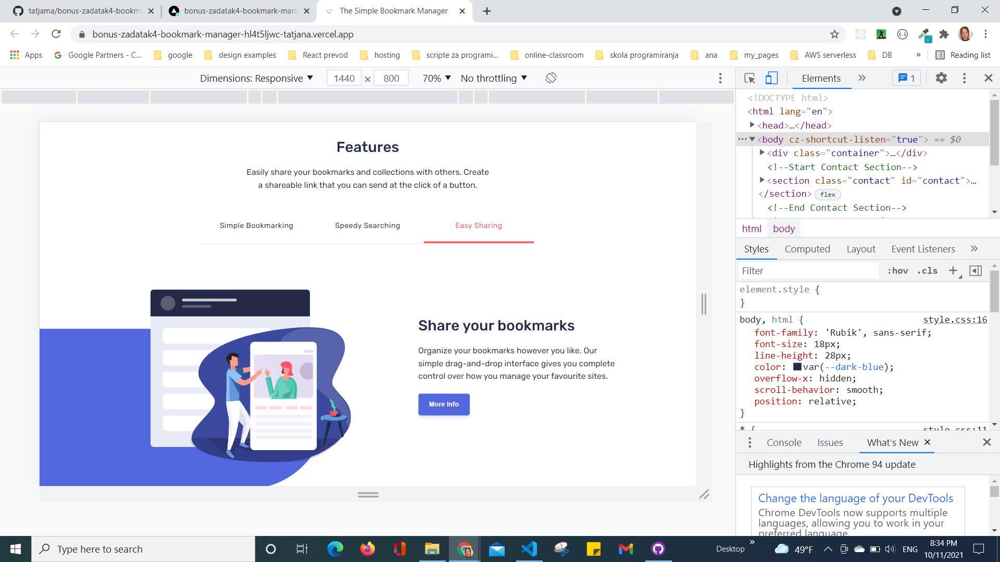
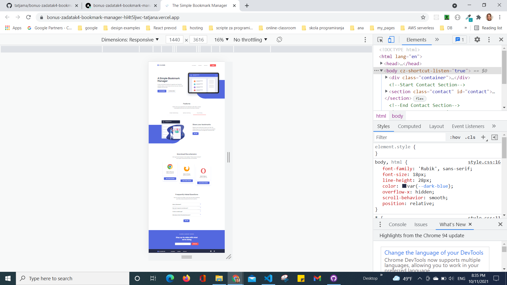
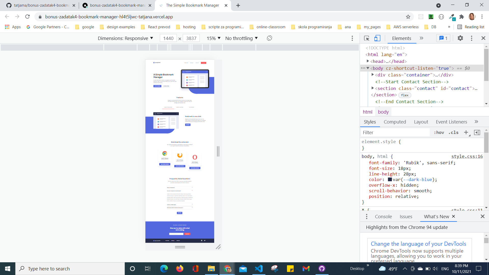
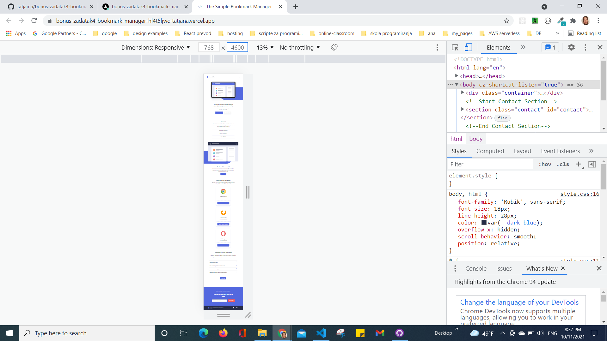
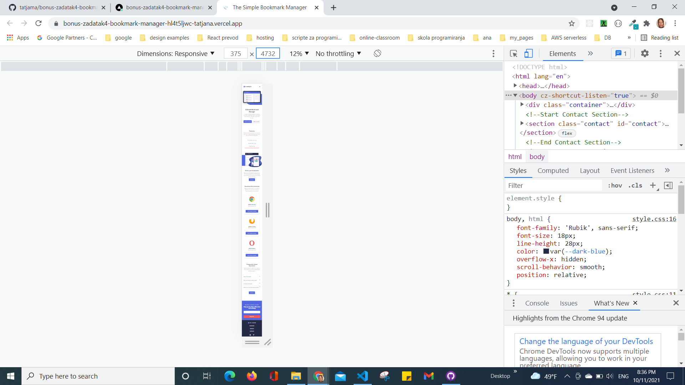
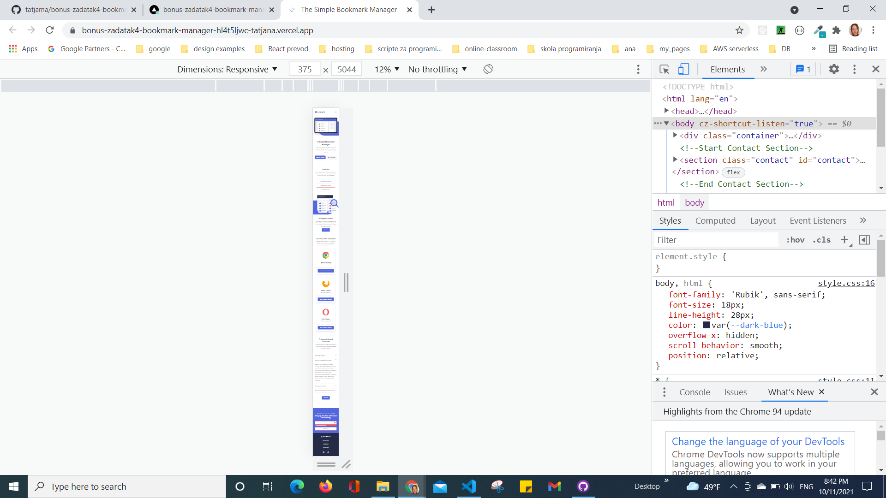
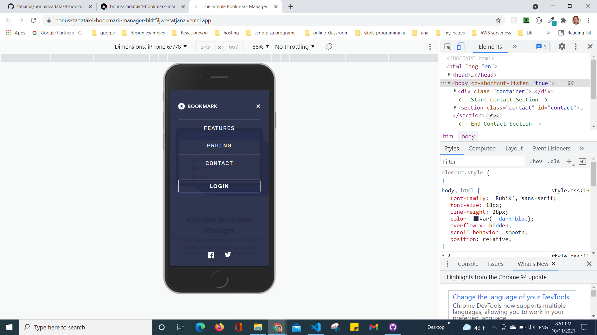

### Links

- Solution URL: [GitHub](https://github.com/tatjama/bonus-zadatak4-bookmark-manager/tree/develop)
- Preview: [Vercel](https://bonus-zadatak4-bookmark-manager-645noe8v2-tatjana.vercel.app/)
- Live Site URL: [Vercel](https://bonus-zadatak4-bookmark-manager.vercel.app/)

## My process

1. Create a new project
2. Import starting code
3. Initializing git repositories main and develop
4. Import git repositories to the Vercel project
5. Create HTML structure
6. Use Figma design tools for style
7. Create CSS Utility
8. Style for Desktop 
9. Form validation JavaScript
10. Show Answers on FAQ Section JavaScript
11. Navigate Features Pages JavaScript
12. Responsive Mobile style
13. Responsive Tablet style
14. Compare original designs with my work
15. Create screenshots
16. Change README-template.md to README.md
17. Open Pull request
18. Solve Issue
19. Merge develop branch into master branch
### Built with

1. Semantic HTML5 markup
2. CSS custom properties
- FlexBox
- Media queries
- Centering elements, content and text
- Element positioning
- Customize font,width and size
- Transparency
- Hover
- CSS variables
3. JavaScript
- DOM manipulation   
- Event handling
## Author

- Website - [Tatjana Markovic](https://my-react-portfolio-tatjana.vercel.app/)
- LinkedIn - [Tatjana Marković](https://www.linkedin.com/in/tatjana-markovi%C4%87-919501189/)
- GitHub - [tatjama](https://github.com/tatjama)

